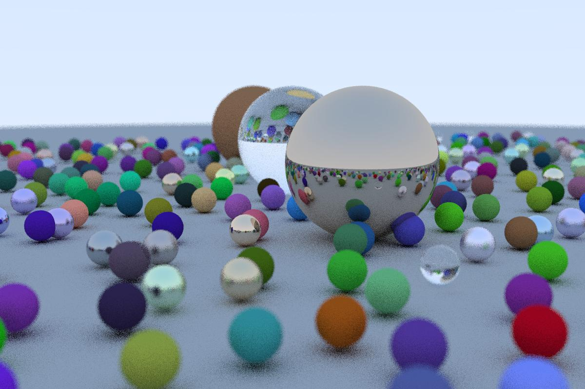
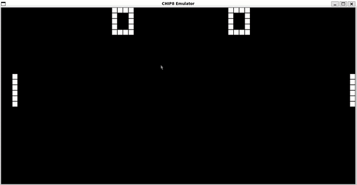

# 📂 Projects

Here’s a showcase of my notable projects, complete with visuals and descriptions.

---

## 1. CuRay

**Description**: A GPU-accelerated raytracer enhancing Peter Shirley’s *Ray Tracing in One Weekend* with CUDA optimizations.  
- **Language**: C++, CUDA  
- **Highlights**: Reduced render times from 90 seconds to 2.5 seconds on Ryzen 5600X/RTX 3060.  
- [View on GitHub](https://github.com/osarana/CuRay)

---

## 2. CHIP-8 Emulator

**Description**: A CHIP-8 emulator supporting graphics, input, sound, and timers using SDL2.  
- **Language**: C, SDL2  
- **Highlights**: Capable of running `.ch8` games like Pong, Tetris, and Space Invaders.  
- [View on GitHub](https://github.com/osarana/CHIP8)

